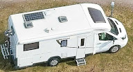

# 🚐 Nilssons Husbilslogg

En modern och premium reseplattform för att logga husbilsäventyr, hitta gömda pärlor och bevara minnen från vägen. Designad för att kännas som en native app (PWA) med fokus på användarvänlighet och visuell elegans.



## ✨ Egenskaper

- **📍 Interaktiv Kartupptäckt**: Utforska campingar, ställplatser och naturreservat via realtidsdata från OpenStreetMap (Overpass API).
- **✅ Smart Incheckning**: Logga besök med datum, anteckningar och framtida bilduppladdning. Visas med gröna ✓-ikoner direkt på kartan.
- **📱 Native-känsla (PWA)**: Installera som app på iOS och Android. Fullt stöd för "Safe Areas" (notch), offline-caching och mobiloptimerade touch-ytor.
- **🎨 Premium UI**: Modern estetik med Glassmorphism, mjuka gradienter och fullt stöd för mörkt läge (Dark Mode).
- **⚡ Realtidssynk**: All data lagras och synkas i realtid via Firebase Firestore.
- **🔐 Säker Inloggning**: Enkel och säker inloggning via Firebase Magic Links.
- **🗺️ Dynamiska Kartstilar**: Växla mellan Outdoor, Landscape, Cykelkartor eller mjuka Stadia-stilar.

## 🚀 Teknikstack

- **Framework**: [Next.js 14](https://nextjs.org/) (App Router)
- **Språk**: [TypeScript](https://www.typescriptlang.org/)
- **Styling**: Vanilla CSS (Modern CSS Variables & Glassmorphism)
- **Karta**: [React-Leaflet](https://react-leaflet.js.org/) med [Thunderforest](https://www.thunderforest.com/) & [Stadia Maps](https://stadiamaps.com/)
- **Backend**: [Firebase](https://firebase.google.com/) (Auth, Firestore)
- **Deployment**: [Docker](https://www.docker.com/) & [Google Cloud Build](https://cloud.google.com/build)

## 🛠️ Kom igång lokalt

1. **Klona repot**:
   ```bash
   git clone https://github.com/Sirbobba/nilssonshusbilstrips.git
   cd nilssonshusbilstrips
   ```

2. **Installera beroenden**:
   ```bash
   npm install
   ```

3. **Konfigurera miljövariabler**:
   Skapa en `.env.local` fil baserad på dina Firebase och kart-API-nycklar:
   ```env
   NEXT_PUBLIC_FIREBASE_API_KEY=your_key
   NEXT_PUBLIC_FIREBASE_AUTH_DOMAIN=your_domain
   NEXT_PUBLIC_FIREBASE_PROJECT_ID=your_project_id
   NEXT_PUBLIC_THUNDERFOREST_API_KEY=your_key
   ```

4. **Kör dev-servern**:
   ```bash
   npm run dev
   ```

5. **Öppna appen**:
   Gå till [http://localhost:3000](http://localhost:3000).

## 🐳 Deployment & Docker

Projektet är förberett för Google Cloud Run via Docker.

**Bygg lokalt:**
```bash
docker build -t nilssonshusbilstrips .
```

**Cloud Build:**
Använd den medföljande `cloudbuild.yaml` för att automatisera deployment till Google Cloud.

---

*Skapad med ❤️ för Nilssons husbilsresor.*
